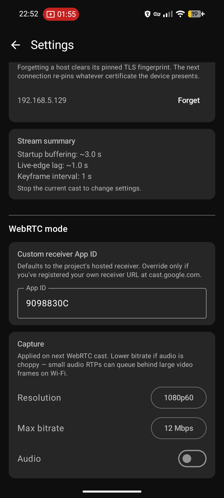
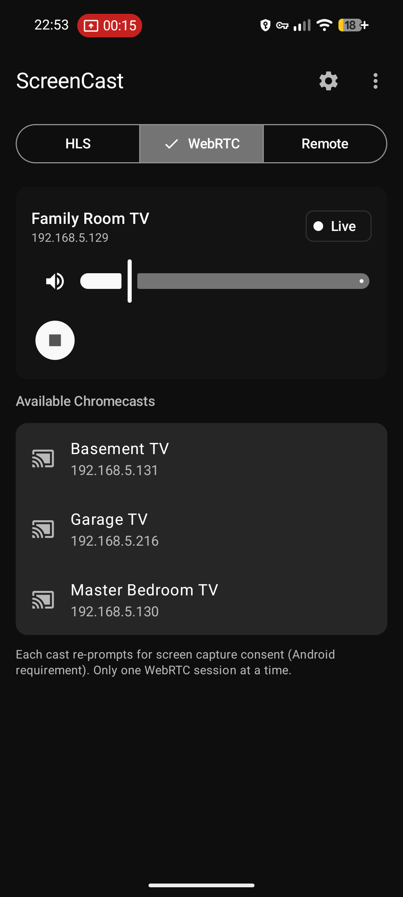
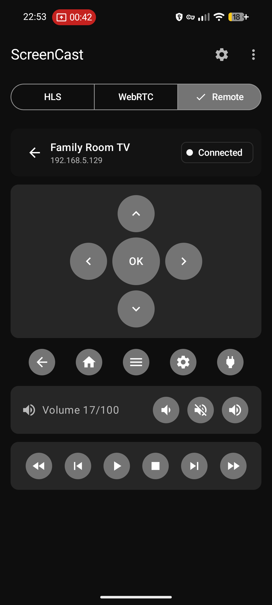

# ScreenCast

An open-source Android app that casts the phone's screen to one or more Chromecast devices over the local Wi-Fi network, with synchronized playback across all connected receivers. Also doubles as a remote control for Android TV / Google TV devices over the polo + Android TV Remote v2 protocols. Vibe-coded and unchecked.

## Screenshots

<p>
  
  
  
  
  
</p>

## How it works

- **Discovery**: `NsdManager` finds Chromecasts via mDNS (`_googlecast._tcp.local`).
- **Control channel**: TLS socket to Chromecast port 8009, Cast V2 protocol implemented in pure Kotlin (connection / heartbeat / receiver / media namespaces).
- **Capture**: Android `MediaProjection` + `MediaCodec` (H.264), optional audio via `AudioPlaybackCapture`.
- **Transport**: HLS served from an embedded Ktor HTTP server on the phone. The server binds only to the Wi-Fi interface IP on a freshly-picked ephemeral port (not `0.0.0.0:8080`), so it isn't reachable over cellular or any other interface. The playlist lives under a path gated by a 128-bit random token (e.g. `http://<phone-ip>:<port>/c/<token>/stream.m3u8`); the token is generated fresh per cast session and is only valid while the foreground service is running. The Chromecast loads that URL through the Default Media Receiver (App ID `CC1AD845`). Expect ~5–10 s of latency.
- **Multi-device casting**: Up to 4 Chromecasts can subscribe to the same HLS stream in parallel. Each has its own Cast V2 session, transport controls, and volume. The capture pipeline is started once on the first device and reused for the rest, so adding a second receiver doesn't retrigger the MediaProjection consent dialog.
- **Sync across receivers**: HLS LIVE doesn't give receivers a shared clock, so by default each one picks its own live-edge and they drift. With **Sync start** enabled (Settings), the app coordinates a pause → seek → play handshake whenever a new device joins so every receiver lands on the same stream offset. A background loop then re-aligns every ~15 s: it polls `currentTime` on every session, pauses them all, seeks to the laggard's offset, and plays them back in parallel. This is best-effort — receiver-local offsets are only comparable while sessions stay connected.


## WebRTC mode (low-latency) — optional

The default cast path is HLS over HTTP; latency is ~5–10 s. A separate **WebRTC** mode ships alongside it for sub-second latency. It's reachable from the overflow menu on the Cast screen.

WebRTC mode uses a **custom Cast receiver**. The app ships with a default App ID (`9098830C`) pointing at the project's hosted receiver, so it works out of the box. If you'd rather host your own receiver, register its URL at <https://cast.google.com/publish/> and paste the resulting 8-character App ID into the app's WebRTC screen. Static receiver page + instructions live in [`receiver/`](receiver/). When you start a cast the app launches the receiver, negotiates a `RTCPeerConnection` over the Cast channel, and streams the screen directly. No HLS server, no drift/sync coordination, no multi-device fan-out.

Tradeoffs versus HLS mode:

- One Chromecast per cast (no parallel receivers).
- No pause/play/seek, no volume UI (WebRTC has no concept of media transport).
- The WebRTC Android library is a pre-built open-source AAR from [webrtc-sdk/android](https://github.com/webrtc-sdk/android) (BSD-3). Adds ~18 MB of native code across 4 ABIs. Building it from Chromium source ourselves is listed as a future decision in `CLAUDE.md`.

## Remote control mode

Switch the segmented control at the top to **Remote** to use the app as a remote for an Android TV / Google TV — the same role the Google Home app plays. No proprietary dependencies; the polo pairing handshake and the Android TV Remote v2 control channel are implemented in pure Kotlin against schemas vendored from [tronikos/androidtvremote2](https://github.com/tronikos/androidtvremote2).

- **Discovery**: `NsdManager` finds TVs via mDNS (`_androidtvremote2._tcp.local`) — independent of the Chromecast discovery used by the cast modes.
- **Pairing (one-time)**: TLS connect to port 6467, then a 6-step polo handshake (request → options → configuration → ack → secret → ack). The TV displays a 6-digit hex code on screen; you type it into the dialog on the phone. The app generates a per-install RSA-2048 client cert (no BouncyCastle — hand-rolled X.509 v3 DER) and stores it under [androidx.security `EncryptedFile`](https://developer.android.com/topic/security/data) with a Keystore-derived AES-256-GCM master key. The TV's server cert SHA-256 is pinned in app-private SharedPreferences for subsequent connections.
- **Control channel**: mTLS to port 6466 using the paired client cert + server pin. Sends `RemoteKeyInject` for D-pad / nav / media-transport keys, replies to the TV's keepalive `RemotePingRequest` from inside the read loop, and mirrors `RemoteSetVolumeLevel` pushes into a Compose `StateFlow` so the volume readout follows physical-remote presses live.
- **Settings shortcut**: maps to long-press Home (which on Sony BRAVIA opens the Action Menu where Settings lives), since `KEYCODE_SETTINGS` itself goes unbound on Sony firmware.
- **Re-pair after a TV factory reset**: tap **Forget** on the row in the Remote picker, then re-pair from scratch — the TV's new server cert is pinned on the new SECRET_ACK exchange.

## Requirements

- Android 8.0+ (API 26).
- A Chromecast on the same Wi-Fi network.

## Build

The Gradle wrapper is checked in. You only need a JDK 17 or 21 — Gradle itself is downloaded on first run.

```sh
export JAVA_HOME=/path/to/jdk-21
./gradlew assembleDebug
```

Output: `app/build/outputs/apk/debug/app-debug.apk`.

Pinned to Gradle 9.4.1; tested against Android Studio's bundled JBR 21.

Debug builds install side-by-side with release (`applicationId` suffix `.debug`).

### Release signing

Release builds require a keystore. Create one with `keytool -genkey -v -keystore release.jks -keyalg RSA -keysize 2048 -validity 10000 -alias screencast` and then either:

1. **Local:** create `keystore.properties` at the repo root (gitignored):
   ```properties
   storeFile=/absolute/path/to/release.jks
   storePassword=...
   keyAlias=screencast
   keyPassword=...
   ```
2. **CI:** set env vars `SCREENCAST_KEYSTORE_FILE`, `SCREENCAST_KEYSTORE_PASSWORD`, `SCREENCAST_KEY_ALIAS`, `SCREENCAST_KEY_PASSWORD`.

Then `./gradlew assembleRelease`. Without credentials `assembleRelease` still runs, but emits `app-release-unsigned.apk` — not installable. Debug builds are unaffected either way.

## Project layout

```
app/src/main/java/io/github/ddagunts/screencast/
├── cast/      # Cast V2 protocol (discovery, TLS channel, session FSM)
├── media/     # HLS mode: screen capture, H.264 encode, HLS muxer, Ktor server
├── webrtc/    # WebRTC mode: PeerConnection, signaling over custom Cast namespace
├── androidtv/ # Remote mode: polo pairing + ATV Remote v2 control channel
├── ui/        # Jetpack Compose UI + ViewModels (one per mode)
└── util/      # Networking, logging
app/src/main/proto/   # Vendored polo + remotemessage .proto schemas (spec only — codec is hand-rolled)
receiver/             # WebRTC custom Cast receiver (static HTML/JS)
```

## License

Apache-2.0.
