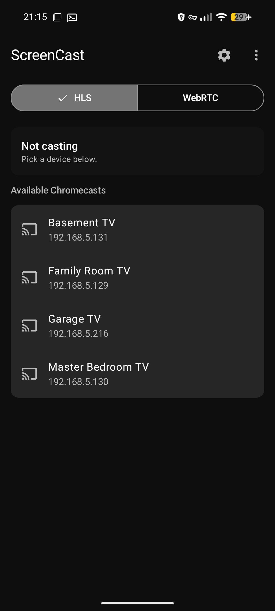
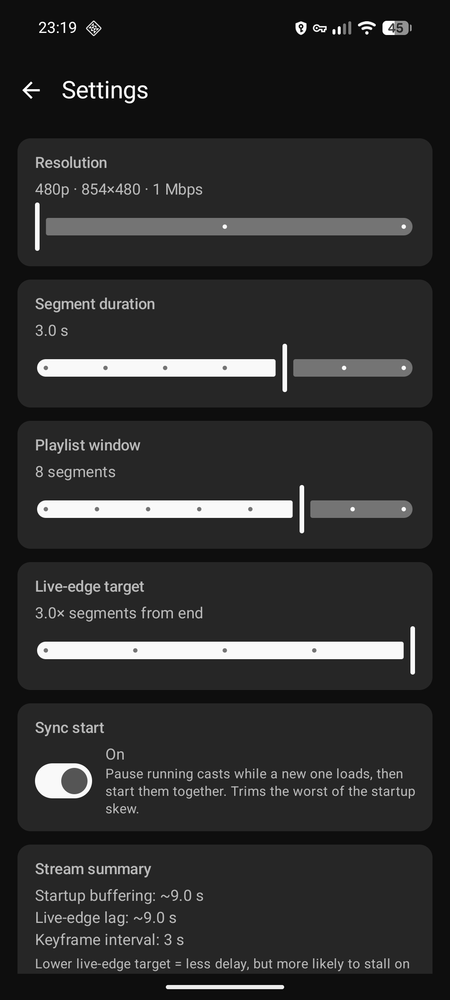
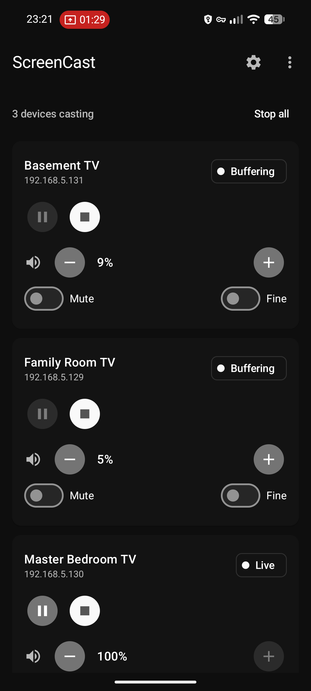

# ScreenCast

An open-source Android app that casts the phone's screen to one or more Chromecast devices over the local Wi-Fi network, with synchronized playback across all connected receivers. Vibe-coded and unchecked.

## Screenshots

<p>
  
  
  
</p>

## How it works

- **Discovery**: `NsdManager` finds Chromecasts via mDNS (`_googlecast._tcp.local`).
- **Control channel**: TLS socket to Chromecast port 8009, Cast V2 protocol implemented in pure Kotlin (connection / heartbeat / receiver / media namespaces).
- **Capture**: Android `MediaProjection` + `MediaCodec` (H.264), optional audio via `AudioPlaybackCapture`.
- **Transport**: HLS served from an embedded Ktor HTTP server on the phone. The server binds only to the Wi-Fi interface IP on a freshly-picked ephemeral port (not `0.0.0.0:8080`), so it isn't reachable over cellular or any other interface. The playlist lives under a path gated by a 128-bit random token (e.g. `http://<phone-ip>:<port>/c/<token>/stream.m3u8`); the token is generated fresh per cast session and is only valid while the foreground service is running. The Chromecast loads that URL through the Default Media Receiver (App ID `CC1AD845`). Expect ~5–10 s of latency.
- **Multi-device casting**: Up to 4 Chromecasts can subscribe to the same HLS stream in parallel. Each has its own Cast V2 session, transport controls, and volume. The capture pipeline is started once on the first device and reused for the rest, so adding a second receiver doesn't retrigger the MediaProjection consent dialog.
- **Sync across receivers**: HLS LIVE doesn't give receivers a shared clock, so by default each one picks its own live-edge and they drift. With **Sync start** enabled (Settings), the app coordinates a pause → seek → play handshake whenever a new device joins so every receiver lands on the same stream offset. A background loop then re-aligns every ~15 s: it polls `currentTime` on every session, pauses them all, seeks to the laggard's offset, and plays them back in parallel. This is best-effort — receiver-local offsets are only comparable while sessions stay connected.


## WebRTC mode (low-latency) — optional

The default cast path is HLS over HTTP; latency is ~5–10 s. A separate **WebRTC** mode ships alongside it for sub-second latency. It's reachable from the overflow menu on the Cast screen.

WebRTC mode uses a **custom Cast receiver**. The app ships with a default App ID (`9098830C`) pointing at the project's hosted receiver, so it works out of the box. If you'd rather host your own receiver, register its URL at <https://cast.google.com/publish/> and paste the resulting 8-character App ID into the app's WebRTC screen. Static receiver page + instructions live in [`receiver/`](receiver/). When you start a cast the app launches the receiver, negotiates a `RTCPeerConnection` over the Cast channel, and streams the screen directly. No HLS server, no drift/sync coordination, no multi-device fan-out.

Tradeoffs versus HLS mode:

- One Chromecast per cast (no parallel receivers).
- No pause/play/seek, no volume UI (WebRTC has no concept of media transport).
- The WebRTC Android library is a pre-built open-source AAR from [webrtc-sdk/android](https://github.com/webrtc-sdk/android) (BSD-3). Adds ~18 MB of native code across 4 ABIs. Building it from Chromium source ourselves is listed as a future decision in `CLAUDE.md`.

## Requirements

- Android 8.0+ (API 26).
- A Chromecast on the same Wi-Fi network.

## Build

The Gradle wrapper is checked in. You only need a JDK 17 or 21 — Gradle itself is downloaded on first run.

```sh
export JAVA_HOME=/path/to/jdk-21
./gradlew assembleDebug
```

Output: `app/build/outputs/apk/debug/app-debug.apk`.

Pinned to Gradle 9.4.1; tested against Android Studio's bundled JBR 21.

Debug builds install side-by-side with release (`applicationId` suffix `.debug`).

### Release signing

Release builds require a keystore. Create one with `keytool -genkey -v -keystore release.jks -keyalg RSA -keysize 2048 -validity 10000 -alias screencast` and then either:

1. **Local:** create `keystore.properties` at the repo root (gitignored):
   ```properties
   storeFile=/absolute/path/to/release.jks
   storePassword=...
   keyAlias=screencast
   keyPassword=...
   ```
2. **CI:** set env vars `SCREENCAST_KEYSTORE_FILE`, `SCREENCAST_KEYSTORE_PASSWORD`, `SCREENCAST_KEY_ALIAS`, `SCREENCAST_KEY_PASSWORD`.

Then `./gradlew assembleRelease`. Without credentials `assembleRelease` still runs, but emits `app-release-unsigned.apk` — not installable. Debug builds are unaffected either way.

## Project layout

```
app/src/main/java/io/github/ddagunts/screencast/
├── cast/     # Cast V2 protocol (discovery, TLS channel, session FSM)
├── media/    # HLS mode: screen capture, H.264 encode, HLS muxer, Ktor server
├── webrtc/   # WebRTC mode: PeerConnection, signaling over custom Cast namespace
├── ui/       # Jetpack Compose UI + ViewModels (one per mode)
└── util/     # Networking, logging
receiver/     # WebRTC custom Cast receiver (static HTML/JS)
```

## License

Apache-2.0.
